```mermaid
classDiagram
    %% ============================================
    %% データクラス層 (Data Classes)
    %% ============================================
    class Expense {
        +String id
        +String generatedType
        +String datetime
        +Long timestamp
        +Long amount
        +Category category
        +String note
        +String storeName
        +String itemName
    }

    class Category {
        +String id
        +Long timestamp
        +String name
        +Boolean enabled
    }

    class RepeatAdd {
        +String id
        +Long timestamp
        +Expense expense
        +Frequency frequencyInfo
    }

    class Frequency {
        +String frequency
        +Int month
        +Int day
        +List~Int~ dayOfWeek
        +Int hour
        +Int minute
    }

    class CategoryAssignment {
        +String id
        +String categoryId
        +String name
        +String condition
        +Boolean regex
        +String generatedType
    }

    class CategoryAssignmentData {
        +Map~String,CategoryAssignment~ storeName
        +Map~String,CategoryAssignment~ productName
    }

    class UserPreference {
        +String timeZone
    }

    class ExpenseSearchFilter {
        +String dateFrom
        +String dateTo
        +List~String~ categoryIds
        +List~String~ generatedTypes
        +Long amountMin
        +Long amountMax
        +String storeName
        +String itemName
        +String note
    }

    %% ============================================
    %% インターフェース層 (Interfaces)
    %% ============================================
    class CommonProperty {
        <<interface>>
        +String id
        +Long timestamp
    }

    class HasId {
        <<interface>>
        +String id
    }

    class HasCategoryId {
        <<interface>>
        +String categoryId
    }

    %% ============================================
    %% Firebase基盤層 (Firebase Infrastructure)
    %% ============================================
    class FirebaseAuth {
        <<Firebase>>
    }

    class FirestoreReference {
        -FirebaseAuth firebaseAuth
        +getUsersColRef() CollectionReference
        +getUserDocRef() DocumentReference
        +getExpensesColRef() CollectionReference
        +getCategoriesColRef() CollectionReference
        +getRepeatAddColRef() CollectionReference
        +getMailboxExtractionColRef() CollectionReference
        +getSettingsColRef() CollectionReference
        +getUserPreferencesDocRef() DocumentReference
    }

    class RealtimeDbReference {
        -FirebaseAuth firebaseAuth
        +getUserRef() DatabaseReference
        +getCategoryAssignmentRef() DatabaseReference
        +getMailboxExtractionRef() DatabaseReference
    }

    class FirestoreListenerManager {
        -FirestoreReference firestoreReference
        +listenToExpensesModifiedRemoved() void
        +listenToNewExpensesOnly() void
        +listenToCategoriesModifiedRemoved() void
        +listenToNewCategoriesOnly() void
        +clearAllListeners() void
    }

    class RealtimeDbListenerManager {
        -RealtimeDbReference realtimeDbReference
        +addListeners() void
        +clearAllListeners() void
    }

    %% ============================================
    %% Repository層 (Data Access)
    %% ============================================
    class FirebaseAuthRepository {
        -FirebaseAuth firebaseAuth
        +getIdToken() String
    }

    class ExpenseFirestoreRepository {
        -FirestoreReference firestoreReference
        +addExpense(Expense) Expense
        +updateExpense(Expense) void
        +removeExpense(Expense) void
        +fetchMonthsExpenses(YearMonth, YearMonth) List~Expense~
        +fetchAllExpenses() List~Expense~
        +fetchNotCategorizedExpenses() List~Expense~
        +searchExpenses(ExpenseSearchFilter) List~Expense~
    }

    class CategoryFirestoreRepository {
        -FirestoreReference firestoreReference
        +addCategory(Category) Category
        +updateCategory(Category) void
        +removeCategory(Category) void
        +fetchAllCategories() List~Category~
    }

    class CategoryLocalRepository {
        -AppDatabase database
        +getAllCategories() List~Category~
        +getAllCategoriesFlow() Flow~List~Category~~
        +insertCategory(Category) void
        +updateCategory(Category) void
        +deleteCategory(Category) void
        +replaceAllCategories(List~Category~) void
        +deleteAllCategories() void
    }

    class RepeatAddFirestoreRepository {
        -FirestoreReference firestoreReference
        +addRepeatAdd(RepeatAdd) RepeatAdd
        +updateRepeatAdd(RepeatAdd) void
        +removeRepeatAdd(RepeatAdd) void
        +fetchAllRepeatAdd() List~RepeatAdd~
    }

    class UserSettingsFirestoreRepository {
        -FirebaseAuth firebaseAuth
        -FirestoreReference firestoreReference
        +getUserTimeZone() String
        +updateUserTimeZone(String) void
    }

    class CategoryAssignmentRepository {
        -RealtimeDbReference realtimeDbReference
        +getCategoryAssignmentData() CategoryAssignmentData
        +getCategoryAssignments(DatabaseReference) Map~String,CategoryAssignment~
        +addCategoryAssignment(CategoryAssignment, DatabaseReference) void
        +updateCategoryAssignment(CategoryAssignment, DatabaseReference) void
        +removeCategoryAssignment(CategoryAssignment, DatabaseReference) void
        +getStoreNameCategoryAssignmentRef() DatabaseReference
        +getProductNameCategoryAssignmentRef() DatabaseReference
    }

    class MailboxExtractionRTDbRepository {
        -RealtimeDbReference realtimeDbReference
        +getMailTypeSetting(EmailTemplateType) Any
        +updateMailTypeSetting(EmailTemplateType, Any) void
    }

    %% ============================================
    %% UseCase層 (Business Logic)
    %% ============================================
    class CategoryUseCase {
        -CategoryFirestoreRepository categoryRepository
        -CategoryLocalRepository categoryLocalRepository
        -RepeatAddFirestoreRepository repeatAddRepository
        -MailboxExtractionRTDbRepository mailboxExtractionRepository
        -CategoryAssignmentRepository categoryAssignmentRepository
        +fetchAllCategories() List~Category~
        +getCachedCategories() List~Category~
        +getCategoriesFlow() Flow~List~Category~~
        +clearLocalCache() void
        +addCategory(Category) Category
        +updateCategory(Category) void
        +removeCategory(Category) void
        +checkRepeatAddExists(String) Boolean
        +checkCategoryExistInCategoryAssignment(String) Boolean
        +checkCategoryExistInEmailTemplateType(String) Boolean
    }

    class CategoryAssignmentUseCase {
        -CategoryAssignmentRepository categoryAssignmentRepository
        +getCategoryAssignmentRef(CategoryAssignNamePattern) DatabaseReference
        +getCategoryAssignmentData() CategoryAssignmentData
        +addCategoryAssignmentWithCheck(CategoryAssignment, CategoryAssignNamePattern) void
        +updateCategoryAssignmentWithCheck(CategoryAssignment, CategoryAssignNamePattern) void
        +removeCategoryAssignment(CategoryAssignment, CategoryAssignNamePattern) void
    }

    class RepeatAddUseCase {
        -RepeatAddFirestoreRepository repeatAddRepository
        -ExpenseFirestoreRepository expenseRepository
        +checkNewRepeatAddValid(RepeatAdd) String
        +addRepeatAdd(RepeatAdd, Boolean) RepeatAdd
        +updateRepeatAdd(RepeatAdd, Boolean) void
        +removeRepeatAdd(RepeatAdd) void
        +fetchAllRepeatAdd() List~RepeatAdd~
        +addExpensesForRestOfDaysFlow(RepeatAdd) Flow~Float~
    }

    %% ============================================
    %% ViewModel層 (Presentation Logic)
    %% ============================================
    class ExpenseSharedViewModel {
        -ExpenseFirestoreRepository expenseRepository
        -CategoryUseCase categoryUseCase
        -UserSettingsFirestoreRepository userSettingsRepository
        -FirestoreListenerManager listenerManager
        -StateFlow~List~Expense~~ storedExpenses
        -StateFlow~List~Category~~ allCategories
        +addExpense(Expense) Expense
        +updateExpense(Expense) void
        +removeExpense(Expense) void
        +fetchMonthsExpenses(YearMonth, YearMonth) void
        +addCategory(Category) Category
        +updateCategory(Category) void
        +removeCategory(Category) void
        +fetchAllCategories() void
        +addAllListeners(YearMonth) void
        +clearAllListeners() void
        +onSignedIn() void
        +onSignedUp() void
        +onSignedOut() void
    }

    class ExpenseAddEditViewModel {
        -ExpenseSharedViewModel expenseSharedViewModel
        -TemporaryExpenseViewModel tmpExpenseViewModel
        -CategoryAssignmentUseCase categoryAssignmentUseCase
        -StateFlow~List~Expense~~ expenseList
        -StateFlow~Boolean~ splitInputEnabled
        -StateFlow~Long~ totalAmount
        +updateExpense(Expense) void
        +updateExpenseAt(Int, Expense) void
        +addExpenseToDb() void
        +updateExpenseToDb() void
        +removeExpenseToDb() void
        +addCategoryAssignment(CategoryAssignment, CategoryAssignNamePattern) void
        +switchSplitInput() void
        +calcLastExpenseAmount() void
    }

    class ExpenseListViewModel {
        -ExpenseSharedViewModel expenseSharedViewModel
        -TemporaryExpenseViewModel tmpExpenseViewModel
        -SharedImageViewModel sharedImageViewModel
        -SharedNotificationListenerViewModel sharedNotificationListenerViewModel
        -StateFlow~Int~ monthOffset
        -StateFlow~List~Expense~~ filteredExpenses
        -StateFlow~Long~ monthTotalExpense
        +updateStoredExpenses(Int, Int) void
        +filterExpensesByMonth() void
        +calcMonthTotalExpense() void
        +calcMonthlyEstimatedExpense() void
        +setToTmpExpense(Expense) void
        +incrementMonth() void
        +decrementMonth() void
    }

    class TemporaryExpenseViewModel {
        -StateFlow~List~Expense~~ tmpExpenseList
        +updateTmpExpense(Expense) void
        +resetTmpExpenseList() void
    }

    class SearchViewModel {
        -ExpenseFirestoreRepository expenseRepository
        -ExpenseSharedViewModel expenseSharedViewModel
        +searchExpenses(ExpenseSearchFilter) List~Expense~
    }

    class CategoryEditViewModel {
        -ExpenseSharedViewModel expenseSharedViewModel
        +addCategory(Category) void
        +updateCategory(Category) void
        +removeCategory(Category) void
    }

    class RepeatAddViewModel {
        -RepeatAddUseCase repeatAddUseCase
        -ExpenseSharedViewModel expenseSharedViewModel
        +addRepeatAdd(RepeatAdd) void
        +updateRepeatAdd(RepeatAdd) void
        +removeRepeatAdd(RepeatAdd) void
        +fetchAllRepeatAdd() void
    }

    class CategoryAssignmentViewModel {
        -CategoryAssignmentUseCase categoryAssignmentUseCase
        -ExpenseSharedViewModel expenseSharedViewModel
        +getCategoryAssignmentData() void
        +addCategoryAssignment(CategoryAssignment, CategoryAssignNamePattern) void
        +updateCategoryAssignment(CategoryAssignment, CategoryAssignNamePattern) void
        +removeCategoryAssignment(CategoryAssignment, CategoryAssignNamePattern) void
    }

    %% ============================================
    %% 関係性 (Relationships)
    %% ============================================
    
    %% データクラスの継承・関連
    CommonProperty <|.. Expense
    CommonProperty <|.. Category
    CommonProperty <|.. RepeatAdd
    HasId <|.. CategoryAssignment
    Expense *-- Category
    RepeatAdd *-- Expense
    RepeatAdd *-- Frequency
    CategoryAssignmentData o-- CategoryAssignment

    %% Firebase基盤層の依存関係
    FirestoreReference ..> FirebaseAuth
    RealtimeDbReference ..> FirebaseAuth
    FirestoreListenerManager ..> FirestoreReference
    RealtimeDbListenerManager ..> RealtimeDbReference
    FirebaseAuthRepository ..> FirebaseAuth

    %% Repository層の依存関係
    ExpenseFirestoreRepository ..> FirestoreReference
    CategoryFirestoreRepository ..> FirestoreReference
    RepeatAddFirestoreRepository ..> FirestoreReference
    UserSettingsFirestoreRepository ..> FirebaseAuth
    UserSettingsFirestoreRepository ..> FirestoreReference
    CategoryAssignmentRepository ..> RealtimeDbReference
    MailboxExtractionRTDbRepository ..> RealtimeDbReference

    %% UseCase層の依存関係
    CategoryUseCase ..> CategoryFirestoreRepository
    CategoryUseCase ..> CategoryLocalRepository
    CategoryUseCase ..> RepeatAddFirestoreRepository
    CategoryUseCase ..> MailboxExtractionRTDbRepository
    CategoryUseCase ..> CategoryAssignmentRepository
    CategoryAssignmentUseCase ..> CategoryAssignmentRepository
    RepeatAddUseCase ..> RepeatAddFirestoreRepository
    RepeatAddUseCase ..> ExpenseFirestoreRepository

    %% ViewModel層の依存関係
    ExpenseSharedViewModel ..> ExpenseFirestoreRepository
    ExpenseSharedViewModel ..> CategoryUseCase
    ExpenseSharedViewModel ..> UserSettingsFirestoreRepository
    ExpenseSharedViewModel ..> FirestoreListenerManager
    
    ExpenseAddEditViewModel ..> ExpenseSharedViewModel
    ExpenseAddEditViewModel ..> TemporaryExpenseViewModel
    ExpenseAddEditViewModel ..> CategoryAssignmentUseCase
    
    ExpenseListViewModel ..> ExpenseSharedViewModel
    ExpenseListViewModel ..> TemporaryExpenseViewModel
    
    SearchViewModel ..> ExpenseFirestoreRepository
    SearchViewModel ..> ExpenseSharedViewModel
    
    CategoryEditViewModel ..> ExpenseSharedViewModel
    RepeatAddViewModel ..> RepeatAddUseCase
    RepeatAddViewModel ..> ExpenseSharedViewModel
    CategoryAssignmentViewModel ..> CategoryAssignmentUseCase
    CategoryAssignmentViewModel ..> ExpenseSharedViewModel

```

## アーキテクチャの説明

### レイヤー構成

1. **データクラス層 (Data Classes)**
   - アプリケーション全体で使用されるデータモデル
   - `Expense`, `Category`, `RepeatAdd`, `CategoryAssignment`など

2. **Firebase基盤層 (Firebase Infrastructure)**
   - FirebaseとのI/Oを管理
   - `FirestoreReference`, `RealtimeDbReference`, `FirestoreListenerManager`

3. **Repository層 (Data Access)**
   - データアクセスロジックをカプセル化
   - Firestore、Realtime Database、ローカルDBへのアクセス
   - `ExpenseFirestoreRepository`, `CategoryFirestoreRepository`, `CategoryLocalRepository`など

4. **UseCase層 (Business Logic)**
   - ビジネスロジックを実装
   - 複数のRepositoryを組み合わせて複雑な処理を実行
   - `CategoryUseCase`, `RepeatAddUseCase`, `CategoryAssignmentUseCase`

5. **ViewModel層 (Presentation Logic)**
   - UIとビジネスロジックの橋渡し
   - StateFlowを使用した状態管理
   - `ExpenseSharedViewModel`, `ExpenseAddEditViewModel`, `ExpenseListViewModel`など

### 主要な設計パターン

- **Repository パターン**: データアクセスの抽象化
- **UseCase パターン**: ビジネスロジックの分離
- **MVVM パターン**: UIとロジックの分離
- **Dependency Injection**: Hiltによる依存性注入
- **Cache-First戦略**: ローカルDBキャッシュ（CategoryLocalRepository）でオフライン対応
