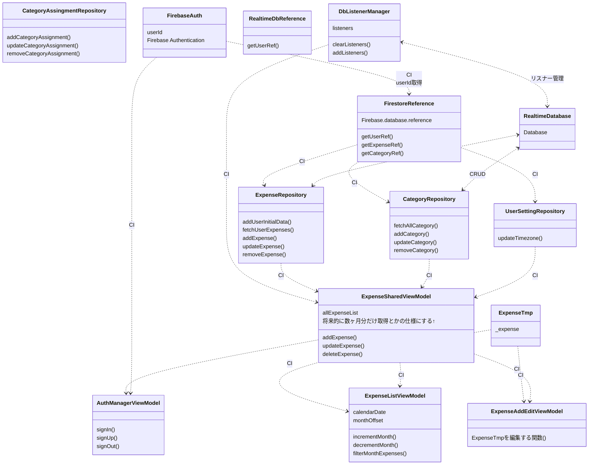

```mermaid
classDiagram

class ExpenseListViewModel{
calendarDate
monthOffset

incrementMonth()
decrementMonth()
filterMonthExpenses()
%%AddEditとこのdeleteがかぶる
}

class ExpenseAddEditViewModel{

ExpenseTmpを編集する関数()
}

class ExpenseTmp{
_expense
}

ExpenseTmp ..> ExpenseListViewModel :CI
ExpenseTmp ..> ExpenseAddEditViewModel :CI


class ExpenseRepository{
addUserInitialData()
fetchUserExpenses()
addExpense()
updateExpense()
removeExpense()
}

class CategoryRepository{
fetchAllCategory()
addCategory()
updateCategory()
removeCategory()
}

class CategoryAssingmentRepository{
addCategoryAssignment()
updateCategoryAssignment()
removeCategoryAssignment()
}

class UserSettingRepository{
updateTimezone()
}

class DbListenerManager {
listeners

clearListeners()
addListeners()
}

class ExpenseSharedViewModel{
allExpenseList
将来的に数ヶ月分だけ取得とかの仕様にする↑

addExpense()
updateExpense()
deleteExpense()
}


ExpenseSharedViewModel ..> AuthManagerViewModel

DbListenerManager ..> ExpenseSharedViewModel :CI
ExpenseRepository ..> ExpenseSharedViewModel :CI
CategoryRepository ..> ExpenseSharedViewModel :CI
UserSettingRepository ..> ExpenseSharedViewModel:CI
ExpenseSharedViewModel ..> ExpenseListViewModel :CI
ExpenseSharedViewModel ..> ExpenseAddEditViewModel :CI


class FirestoreReference {
Firebase.database.reference

getUserRef()
getExpenseRef()
getCategoryRef()
}

class RealtimeDbReference{
getUserRef()

}


%% FirestoreReference ..> DbListenerManager : CI
FirestoreReference ..> ExpenseRepository : CI
FirestoreReference ..> CategoryRepository :CI
FirestoreReference ..> UserSettingRepository: CI
DbListenerManager <..> RealtimeDatabase :リスナー管理

class AuthManagerViewModel {
    signIn()
    signUp()
    signOut()
}
%%キモいけどlistenerをサイン・アウト時にクリアするにはこうやって渡すしかないか～
%% DbListenerManager ..> UserManageViewModel :CI
%% UserManageViewModel ..> FirestoreReference : CI

class RealtimeDatabase{
Database
}
RealtimeDatabase <..> ExpenseRepository: CRUD
RealtimeDatabase <..> CategoryRepository :CRUD

class FirebaseAuth{
userId
Firebase Authentication
}

FirebaseAuth ..> AuthManagerViewModel :CI

FirebaseAuth ..> FirestoreReference :CI<br>userId取得

```
