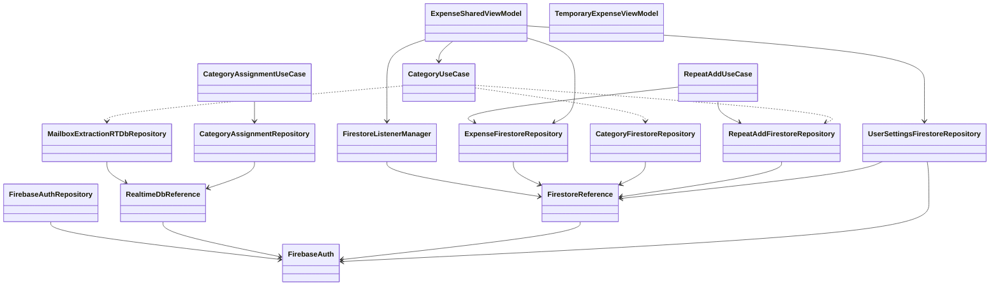

```mermaid
classDiagram

    class FirebaseAuth
    class RealtimeDbReference
    class FirestoreReference
    class FirestoreListenerManager

    class ExpenseFirestoreRepository
    class CategoryFirestoreRepository
    class RepeatAddFirestoreRepository
    class UserSettingsFirestoreRepository
    class MailboxExtractionRTDbRepository
    class CategoryAssignmentRepository
    class FirebaseAuthRepository

    class CategoryAssignmentUseCase
    class RepeatAddUseCase

    %% カテゴリー削除のときに、CategoryIdがAssignmentDataにないかチェックしたい。
    class CategoryUseCase

    class ExpenseSharedViewModel
    class TemporaryExpenseViewModel

    FirebaseAuthRepository --> FirebaseAuth
    RealtimeDbReference --> FirebaseAuth
    FirestoreReference --> FirebaseAuth
    FirestoreListenerManager --> FirestoreReference

    ExpenseFirestoreRepository --> FirestoreReference
    CategoryFirestoreRepository --> FirestoreReference
    RepeatAddFirestoreRepository --> FirestoreReference
    UserSettingsFirestoreRepository --> FirebaseAuth
    UserSettingsFirestoreRepository --> FirestoreReference

    MailboxExtractionRTDbRepository --> RealtimeDbReference
    CategoryAssignmentRepository --> RealtimeDbReference

    CategoryAssignmentUseCase --> CategoryAssignmentRepository
    RepeatAddUseCase --> RepeatAddFirestoreRepository
    RepeatAddUseCase --> ExpenseFirestoreRepository
    CategoryUseCase ..> CategoryFirestoreRepository
    CategoryUseCase ..> RepeatAddFirestoreRepository
    CategoryUseCase ..> MailboxExtractionRTDbRepository

    ExpenseSharedViewModel --> ExpenseFirestoreRepository
    ExpenseSharedViewModel --> CategoryUseCase
    ExpenseSharedViewModel --> UserSettingsFirestoreRepository
    ExpenseSharedViewModel --> FirestoreListenerManager


```
